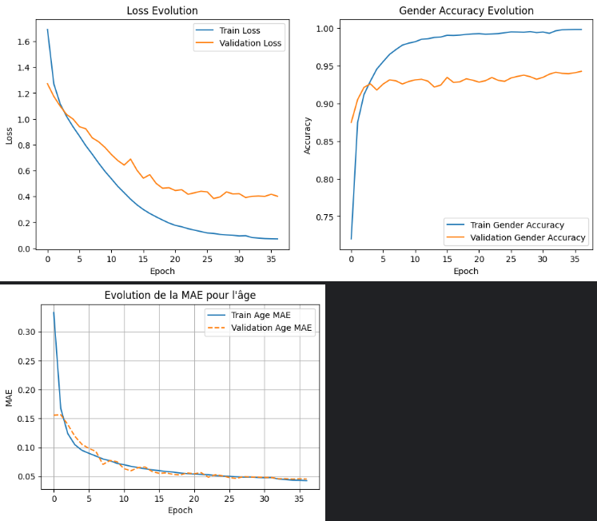

# Mise en contexte
Ce projet a pour objectif de développer une application capable de prédire le genre et l’âge à partir d’une image de visage. 

### L’objectif de ce projet va être de réaliser 4 modèles différents en utilisant le jeu de données UTKFace, à savoir :  
* Modèle de Classification de Genre avec CNN 
* Modèle de Classification d’âge avec une approche de régression 
* Modèle de Classification simultanée de Genre et d’âge 
* Modèle pré-entraîné avec l’utilisation du transfer learning et comparatifs avec d’autres modèles pré-entraînés

### Pour permettre par la suite de :
* Créer une interface Gradio
* Déployer l'application et tous les modèles sur HuggingFaces

## Membres de l'équipe
* CABO India
* GIFFARD Axel
* HAMSEK Fayçal
* OUCHALLAL Samia

La classification de l'âge et du genre est un processus permettant de détecter l'âge et le genre (Homme/Femme) d'une personne en se basant sur des caractéristiques de son visage. On considère les caractéristiques d'une personne par ses traits de visage, ses imperfections, sa pilosité, les rides,etc... \
Toutes ces caractéristiques amènes à détecter l'âge ou le genre d'une personne en fonction d'algorithmes de DeepLearning. Cependant, bien que la détection soit possible, **elle n’en est pas moins certifiée véridique tout le temps.** L'estimation de l'âge varie selon **plusieurs facteurs**, tels que les lumières de l'image, les expressions faciales, le maquillage pour rendre la peau plus "jeune", ...

# L'objectif de réaliser ce projet
<details>
<summary><b>Déroulez pour voir l'ensemble des objectifs : 
</b></summary><br/>
  
- **Exploration et préparation des données** \
  *Analyse du dataset UTKFace (distribution des âges, équilibre hommes/femmes)
  *Prétraitement des images (normalisation, redimensionnement)
  *Augmentation de données pour améliorer la robustesse

- **Comprendre et appliquer les techniques propres au DeepLearning**  
Cela implique d'avoir des notions en mathématiques, science des données, et informatiques pour appliquer des algorithmes d'optimisation linéaire (Fonctions d'activation), de savoir et connaître l'ensemble des paramètres et hyperparamètres utilisés, et de savoir optimiser nos modèles en utilisant des techniques (Dropout, BatchNormalization, learning rate, ...).

- **Comparer différentes architectures de CNN** \
Évaluer les avantages et inconvénients de différentes architectures pour ces tâches spécifiques.

- **Analyser les biais potentiels** \
Identifier les biais potentiels dans les prédictions selon l'éclairage, la qualité de l'image, etc. Les modèles doivent être robustes pour performer de manière constante.

- **Développer une interface utilisateur** \
Créer une interface simple permettant de tester les modèles sur de nouvelles images avec Gradio.
Cela permettra au cours de nos études de présenter ce projet et que les utilisateurs puissent tester l'ensemble de nos modèles.

</details>
  
## Langages et outils
- [Python](https://docs.python.org/)
- [Tensorflow](https://www.tensorflow.org/api_docs).
- [Keras](https://keras.io/).
- [Gradio](https://www.gradio.app/docs).
- [HuggingFaces](https://huggingface.co/)


**Résumé de nos modèles** 

| **Modèle**                                                                                | **Résumé**                                                                                                                                                                        | **Liens**                                                    | **Métriques**                          |
|-------------------------------------------------------------------------------------------|------------------------------------------------------------------------------------------------------------------------------------------------------------------------------------|-------------------------------------------------------------|-------------------------------------------|
| Modèle 1 (Genre)                                                                                 | Classification du genre de manière binaire                                                                    | https://github.com/lxq1000/SwinFace                         | Binary_accuracy, F1_score, AUC                              |
| Modèle 2 (Age)                                                      | Régression de l'âge                                                                                                                                                    | https://github.com/paplhjak/facial-age-estimation-benchmark | MAE,MSE                                 |
| Modèle 3 (Genre + Age)                                                                             | Classification de genre et régression de l'âge en les combinant simultanément                                                                                                                           | https://github.com/WildChlamydia/MiVOLO                     | MAE,MSE, Binary_accuracy                 |
| Modèle 4 (Transfer Learning)                                                                           | Comparatifs de modèles pré-entraînés (EfficientNetB0/1/2, VGG16, MobileNetV2)                                                                                                                           | https://github.com/WildChlamydia/MiVOLO                     | MAE,MSE, RMSE, Precision, Recall, F1_score, Accuracy                 |

Réalisé avec https://www.tablesgenerator.com/markdown_tables
</details>


# Le dataset UTKFace
   ## UTKFace
   Le dataset est [UTKFace](https://susanqq.github.io/UTKFace/). C’est un dataset composé de 23708 images avec toutes les ethniques, l'ensemble des genres et de l'âge allant de 0 à 116 ans. Ces images peuvent avoir des tons de couleurs différents, 
  et des variations dans l’expression des visages.
  
    


## Distribution du genre 


On repère 52.3 % d'hommes et 47.7 % de femmes.
**Cette distribution indique un potentiel biais concernant la classe minoritaire (femmes) et la classe majoritaire (hommes). Les modèles seront susceptibles de se baser sur la classe majoritaire durant l'entraînement, ce qui peut conduire à un surapprentissage (overfitting). Or, ce biais reste néanmoins faible et ne devrait pas poser d'importants problèmes dans les résultats car une différence de 4 % peut être considéré comme quasi-équilibrée.

## Distribution de l'âge 


En faisant cette visualisation, nous remarquons qu'il y a un fort déséquilibre entre les différents âges. Par exemple, il y a énormément d’images de personnes qui ont un âge proche de 26 à 40 ans, peu de jeunes et encore moins de personnes âgées autour de 70 ans. En faisant la moyenne, nous en avons trouvé que le taux le plus important en termes d’âge était de 33 ans.
**En conséquence, le modèle pourrait être plus performant pour estimer l’âge des personnes ayant entre 20 et 40 ans que pour estimer l’âge des personnes entre 60 et 116 ans.**

### Tâches pour optimiser les modèles : 
* Normaliser le genre et l'âge
* Réaliser de la Data Augmentation
* Tranche d'âge pour le modèle de l'âge
* Ajuster et expérimenter les paramètres et hyperparamètres
* Expérimenter les tailles de Batch

## Préparation des données 
Nous faisons un "split" des données grâce à la méthode train_test_split de la librairie sklearn
`
    x_train, x_test, y_train, y_test = train_test_split(
        df['image'],
        df['gender_encoded']],
        test_size=0.2,
        random_state=42
    )
    # Split supplémentaire pour validation
    x_train, x_val, y_train, y_val = train_test_split(
        x_train,
        y_train,
        test_size=0.2, 
        random_state=42
    )
` 

| Dataset      	| Données 	|
|--------------	|---------	|
| Entraînement 	| 18966   	|
| Validation   	| 4742    	|

Nous divisons le dataset en train + val avec 80 % pour le train et 20 % pour le val

## Pré-traitement des données

Les images sont redimenssionnées à une taille uniforme : **224x224** pour les modèles pré-entraînés (conventions de ces modèles) et **128x128** pour le reste des modèles.

### Normalisation de l'âge et du genre

* On vient normaliser l'âge en prenant en compte l'âge supposé maximale dans le dataset (Nous avons pris la valeur 120, même si l'âge maximale est de 116 ans pour faciliter les calculs). 
```python
normalized_age = tf.cast(age,tf.float32) / 120.0
```
* On vient normaliser le genre en divisant par 255 pour transformer la valeur des pixels entre 0 et 1. Ces valeurs vont s'adapter plus rapidement lors de l'entraînement
  ```python
  image=image/255.0
  ```

### Data Augmentation
La technique de la Data Augmentation va permettre d'augmenter la taille du dataset : En créant de nouvelles images à partir des images existantes, on multiplie artificiellement la quantité de données d'entraînement disponibles.
Elle va permettre également de réduire le risque d'overfitting en l'empêchant de se baser sur les mêmes visages.
Elle inclue des transformations de type : 
* Rotation
* Flip
* Zoom
* Luminosité/contraste/saturation

```python
image = tf.image.random_crop(image, size=(96, 96, 3))
        image = tf.image.resize(image, size=size)
        image = tf.image.random_flip_left_right(image)
        image = tf.image.random_brightness(image, max_delta=0.2)
```


</br>
Ce qui peut donner pour un set d'images comme celui-ci : 


## Hyperparamètres utilisées
* Type d'activation : (relu, Sigmoid,softmax)
* learning rate : Généralement 0.0001
* Taille du batch : Généralement 32
* Optimiseur : Généralement Adam
* Dropout : Testé sur 0.2, 0.3 et 0.5
* Kernel_regularizer : Généralement 0.0005
* kernel_size
* strides
* pooling_size=Généralement MaxPooling

### Modèles pré-entraînés + Graphiques
Chaque image est en dimension 224x224

<details>
  <summary><b>EfficientNet (B0/B1/B2)</b></summary><br/>
  
  

  # EfficientNetB0 :
  ```python
  base_model_efficientnet = EfficientNetB0(weights='imagenet', include_top=False, input_shape=(IMAGE_SIZE[0], IMAGE_SIZE[1], 3))
  ```


 ### Résultats (50 epochs)

  # EfficientNetB1 :
  ```python
  base_model_efficientnet = EfficientNetB1(weights='imagenet', include_top=False, input_shape=(IMAGE_SIZE[0], IMAGE_SIZE[1], 3))
  ```
 ### Résultats (50 epochs)

  # EfficientNetB2 :  
  ```python
  base_model_efficientnet = EfficientNetB2(weights='imagenet', include_top=False, input_shape=(IMAGE_SIZE[0], IMAGE_SIZE[1], 3))
  ```

 ### Résultats (50 epochs)
  


</details>
<details>
  <summary><b>VGG16</b></summary><br/>
  
  
  
   ### Résultats (50 epochs)

  

</details>

<details>
  <summary><b>MobileNetV2 </b></summary><br/>
  
  
  
   ### Résultats (50 epochs)
   
  

</details>

<details>
  <summary><b>ResNet50</b></summary><br/>
  
  

</details>

| Modèles             | Accuracy - Genre  | AUC | F1_Score | Precision | Recall | MAE  | MSE    | RMSE  | Age Accuracy (10 ans d'écart en %) | #Params |
|---------------------|-------------------|-----|----------|-----------|--------|------|--------|-------|------------------------------------|---------|
| Genre               |                   |     |          |           |        | -    | -      | -     | -                                  |         |
|         Age         |         -         |  -  |     -    |     -     |    -   |      |        |       |                                    |         |
| Genre + Age         |                   |     |          |           |        |      |        |       |                                    |         |
| TA - EfficientNetB2 |        0.94       |  -  |   0.94   |    0.93   |  0.94  | 5.57 |  63.35 |  7.96 |               83.42%               |         |
| TA - EfficientNetB0 |        0.90       |  -  |   0.90   |    0.90   |  0.81  |   7  |  96.95 |  9.85 |               75.96%               |         |
| TA - EfficientNetB1 |        0.90       |  -  |   0.91   |    0.90   |  0.91  | 6.98 | 103.55 | 10.18 |               76.06%               |         |
|      TA - VGG16     |        0.88       |  -  |   0.89   |    0.89   |  0.89  | 6.86 | 134.40 | 11.59 |               69.57%               |         |
|   TA - MobileNetV2  |        0.93       |     |   0.93   |    0.93   |  0.93  | 5.83 |  68.23 |  8.26 |                82.71               |   3.2M  |

En résumé, le meilleur modèle pré-entrainé est EfficientNetB2 qui prime avec 94 % d'accuracy pour le genre, avec 5.57 d'MAE. Autrement dit, le modèle peut se tromper de genre avec une probabilité de 7%, tandis que pour l'âge, le modèle est susceptible de se tromper entre 5 et 6 ans d'écart. Il peut aussi être ammené à une probabilité de se rapprocher de 83.42 % entre 0 et jusqu'à 10 ans de plus. 


## ✨ Demos
- [Hugging Face Spaces Application Demo ](https://huggingface.co/spaces/samsam2908/ia_sae)
