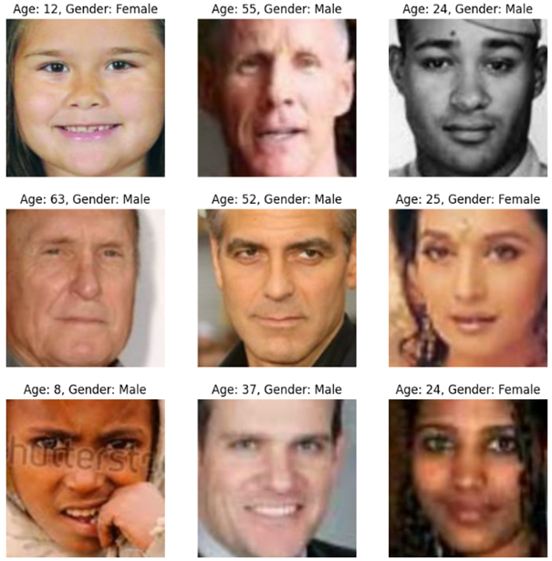
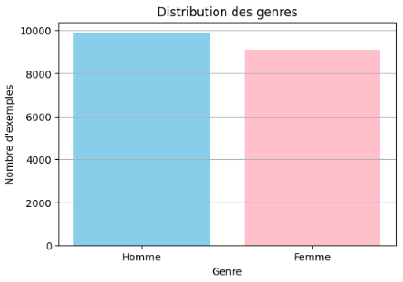

# Mise en contexte
Ce projet a pour objectif de développer une application capable de prédire le genre et l’âge à partir d’une image de visage. 

### L’objectif de ce projet va être de réaliser 4 modèles différents en utilisant le jeu de données UTKFace, à savoir :  
* Modèle de Classification de Genre avec CNN 
* Modèle de Classification d’âge avec une approche de régression 
* Modèle de Classification simultanée de Genre et d’âge 
* Modèle pré-entraîné avec l’utilisation du transfer learning et comparatifs avec d’autres modèles pré-entraînés

### Pour permettre par la suite de :
* Créer une interface Gradio
* Déployer l'application et tous les modèles sur HuggingFaces

## Membres de l'équipe
* CABO India
* GIFFARD Axel
* HAMSEK Fayçal
* OUCHALLAL Samia

La classification de l'âge et du genre est un processus permettant de détecter l'âge et le genre (Homme/Femme) d'une personne en se basant sur des caractéristiques de son visage. On considère les caractéristiques d'une personne par ses traits de visage, ses imperfections, sa pilosité, les rides,etc... \
Toutes ces caractéristiques amènes à détecter l'âge ou le genre d'une personne en fonction d'algorithmes de DeepLearning. Cependant, bien que la détection soit possible, **elle n’en est pas moins certifiée véridique tout le temps.** L'estimation de l'âge varie selon **plusieurs facteurs**, tels que les lumières de l'image, les expressions faciales, le maquillage pour rendre la peau plus "jeune", ...

# L'objectif de réaliser ce projet
<details>
<summary><b>Déroulez pour voir l'ensemble des objectifs : 
</b></summary><br/>
  
- **Exploration et préparation des données** \
  *Analyse du dataset UTKFace (distribution des âges, équilibre hommes/femmes)
  *Prétraitement des images (normalisation, redimensionnement)
  *Augmentation de données pour améliorer la robustesse

- **Comprendre et appliquer les techniques propres au DeepLearning**  
Cela implique d'avoir des notions en mathématiques, science des données, et informatiques pour appliquer des algorithmes d'optimisation linéaire (Fonctions d'activation), de savoir et connaître l'ensemble des paramètres et hyperparamètres utilisés, et de savoir optimiser nos modèles en utilisant des techniques (Dropout, BatchNormalization, learning rate, ...).

- **Comparer différentes architectures de CNN** \
Évaluer les avantages et inconvénients de différentes architectures pour ces tâches spécifiques.

- **Analyser les biais potentiels** \
Identifier les biais potentiels dans les prédictions selon l'éclairage, la qualité de l'image, etc. Les modèles doivent être robustes pour performer de manière constante.

- **Développer une interface utilisateur** \
Créer une interface simple permettant de tester les modèles sur de nouvelles images avec Gradio.
Cela permettra au cours de nos études de présenter ce projet et que les utilisateurs puissent tester l'ensemble de nos modèles.

</details>
  
## Langages et outils
- [Python](https://docs.python.org/)
- [Tensorflow](https://www.tensorflow.org/api_docs).
- [Keras](https://keras.io/).
- [Gradio](https://www.gradio.app/docs).
- [HuggingFaces](https://huggingface.co/)


**Résumé de nos modèles** 

| **Modèle**                                                                                | **Résumé**                                                                                                                                                                        | **Liens**                                                    | **Métriques**                          |
|-------------------------------------------------------------------------------------------|------------------------------------------------------------------------------------------------------------------------------------------------------------------------------------|-------------------------------------------------------------|-------------------------------------------|
| Modèle 1 (Genre)                                                                                 | Classification du genre de manière binaire                                                                    | https://github.com/lxq1000/SwinFace                         | Binary_accuracy, F1_score, AUC                              |
| Modèle 2 (Age)                                                      | Régression de l'âge                                                                                                                                                    | https://github.com/paplhjak/facial-age-estimation-benchmark | MAE,MSE                                 |
| Modèle 3 (Genre + Age)                                                                             | Classification de genre et régression de l'âge en les combinant simultanément                                                                                                                           | https://github.com/WildChlamydia/MiVOLO                     | MAE,MSE, Binary_accuracy                 |
| Modèle 4 (Transfer Learning)                                                                           | Comparatifs de modèles pré-entraînés (EfficientNetB0/1/2, VGG16, MobileNetV2)                                                                                                                           | https://github.com/WildChlamydia/MiVOLO                     | MAE,MSE, RMSE, Precision, Recall, F1_score, Accuracy                 |

Réalisé avec https://www.tablesgenerator.com/markdown_tables
</details>


# Le dataset UTKFace
   ## UTKFace
   Le dataset est [UTKFace](https://susanqq.github.io/UTKFace/). C’est un dataset composé de 23708 images avec toutes les ethniques, l'ensemble des genres et de l'âge allant de 0 à 116 ans. Ces images peuvent avoir des tons de couleurs différents, 
  et des variations dans l’expression des visages.
  
    


## Distribution du genre 



On repère 52.3 % d'hommes et 47.7 % de femmes.
**Cette distribution indique un potentiel biais concernant la classe minoritaire (femmes) et la classe majoritaire (hommes). Les modèles seront susceptibles de se baser sur la classe majoritaire durant l'entraînement, ce qui peut conduire à un surapprentissage (overfitting). Or, ce biais reste néanmoins faible et ne devrait pas poser d'importants problèmes dans les résultats car une différence de 4 % peut être considéré comme quasi-équilibrée.

## Distribution de l'âge 


En faisant cette visualisation, nous remarquons qu'il y a un fort déséquilibre entre les différents âges. Par exemple, il y a énormément d’images de personnes qui ont un âge proche de 26 à 40 ans, peu de jeunes et encore moins de personnes âgées autour de 70 ans. En faisant la moyenne, nous en avons trouvé que le taux le plus important en termes d’âge était de 33 ans.
**En conséquence, le modèle pourrait être plus performant pour estimer l’âge des personnes ayant entre 20 et 40 ans que pour estimer l’âge des personnes entre 60 et 116 ans.**

### Tâches pour optimiser les modèles : 
* Normaliser le genre et l'âge
* Réaliser de la Data Augmentation
* Tranche d'âge pour le modèle de l'âge
* Ajuster et expérimenter les paramètres et hyperparamètres
* Expérimenter les tailles de Batch

## Préparation des données 
Nous faisons un "split" des données grâce à la méthode train_test_split de la librairie sklearn
`
    x_train, x_test, y_train, y_test = train_test_split(
        df['image'],
        df['gender_encoded']],
        test_size=0.2,
        random_state=42
    )
    # Split supplémentaire pour validation
    x_train, x_val, y_train, y_val = train_test_split(
        x_train,
        y_train,
        test_size=0.2, 
        random_state=42
    )
` 

| Dataset      	| Données 	|
|--------------	|---------	|
| Entraînement 	| 18966   	|
| Validation   	| 4742    	|

Nous divisons le dataset en train + val avec 80 % pour le train et 20 % pour le val

## Pré-traitement des données

Les images sont redimenssionnées à une taille uniforme : **224x224** pour les modèles pré-entraînés (conventions de ces modèles) et **128x128** pour le reste des modèles.

### Normalisation de l'âge et du genre

* On vient normaliser l'âge en prenant en compte l'âge supposé maximale dans le dataset (Nous avons pris la valeur 120, même si l'âge maximale est de 116 ans pour faciliter les calculs). 
```python
normalized_age = tf.cast(age,tf.float32) / 120.0
```
* On vient normaliser le genre en divisant par 255 pour transformer la valeur des pixels entre 0 et 1. Ces valeurs vont s'adapter plus rapidement lors de l'entraînement
  ```python
  image=image/255.0
  ```

### Data Augmentation
La technique de la Data Augmentation va permettre d'augmenter la taille du dataset : En créant de nouvelles images à partir des images existantes, on multiplie artificiellement la quantité de données d'entraînement disponibles.
Elle va permettre également de réduire le risque d'overfitting en l'empêchant de se baser sur les mêmes visages.
Elle inclue des transformations de type : 
* Rotation
* Flip
* Zoom
* Luminosité/contraste/saturation

```python
image = tf.image.random_crop(image, size=(96, 96, 3))
        image = tf.image.resize(image, size=size)
        image = tf.image.random_flip_left_right(image)
        image = tf.image.random_brightness(image, max_delta=0.2)
```


</br>
Ce qui peut donner pour un set d'images comme celui-ci : 


#### Contents


1. [Custom Dataset](#custom-dataset)
2. [Define DataLoader](#define-dataloader)

<details>
  <summary><b>1. Custom Dataset</b></summary><br/>
The custom dataset is designed to handle your specific data format and apply any necessary preprocessing steps. You can modify the dataset class according to your data structure, file paths, and preprocessing requirements.
</details>

<details>
  <summary><b>2. DataLoader</b></summary><br/>
The dataloader is responsible for efficiently loading and batching the data from the custom dataset. It provides an iterator interface that allows you to easily access the data during model training or evaluation. You can customize the dataloader settings such as batch size, shuffling, and parallel data loading based on your specific needs.
</details>

## 5. Model

The models used in this project are ResNet50 and EfficientNet B0.

### Contents

1. [ResNet50 Model](#resnet50-model)
2. [EfficientNet B0 Model](#efficientnet-b0-model)
3. [Vision transformer](#efficientnet-b0-model)

<details>
  <summary><b>1. ResNet50</b></summary><br/>
The ResNet50 architecture is a widely-used convolutional neural network that has shown impressive performance on various computer vision tasks. You will learn how to load the pre-trained ResNet50 model, fine-tune it on your custom dataset, and use it for inference.  

   
   
Define Resnet:    

```python
model = AgeEstimationModel(input_dim=3, output_nodes=1, model_name='resnet', pretrain_weights='IMAGENET1K_V2').to(device)
```

</details>

<details>
  <summary><b>2. EfficientNet B0</b></summary><br/>
EfficientNet is a family of convolutional neural networks that have achieved state-of-the-art performance on image classification tasks while being computationally efficient. You will learn how to load the pre-trained EfficientNet B0 model, adapt it to your custom dataset, and leverage its capabilities for classification or feature extraction.  

   
   
Define Efficientnet:   

```python
model = AgeEstimationModel(input_dim=3, output_nodes=1, model_name='efficientnet', pretrain_weights='IMAGENET1K_V1').to(device)
```

</details>

<details>
  <summary><b>3. Vision Transformer</b></summary><br/>
A vision transformer (ViT) is a transformer designed for computer vision.[1] A ViT breaks down an input image into a series of patches (rather than breaking up text into tokens), serialises each patch into a vector, and maps it to a smaller dimension with a single matrix multiplication. These vector embeddings are then processed by a transformer encoder as if they were token embeddings.

    
   
Define Vision Transformer:  

```python
model = AgeEstimationModel(input_dim=3, output_nodes=1, model_name='vit', pretrain_weights=True).to(device)
```

</details>


## 6. Training Process

This repository contains code for the training process of a model, including finding hyperparameters, the training and evaluation loop, and plotting learning curves.

### Contents

1. [Finding Hyperparameters](#finding-hyperparameters)
   1. [Step 1: Calculate the Loss for an Untrained Model](#step-1-calculate-the-loss-for-an-untrained-model-using-a-few-batches)
   2. [Step 2: Train and Overfit the Model on a Small Subset of the Dataset](#step-2-try-to-train-and-overfit-the-model-on-a-small-subset-of-the-dataset)
   3. [Step 3: Train the Model for a Limited Number of Epochs](#step-3-train-the-model-for-a-limited-number-of-epochs-experimenting-with-various-learning-rates)
   4. [Step 4: Create a Small Grid Using Weight Decay and the Best Learning Rate and save it to a CSV file](#step-4-create-a-small-grid-using-the-weight-decay-and-the-best-learning-rate-and-save-it-to-a-CSV-file)
   5. [Step 5: Train the Model for Longer Epochs Using the Best Model from Step 4](#step-5-train-model-for-longer-epochs-using-the-best-model-from-step-4)
2. [Training and Evaluation Loop](#train-and-evaluation-loop)
3. [Plotting Learning Curves with Matplotlib and TensorBoard](#plot-learning-curves)
4. [Save the best model from .pt to .jit](#Save-the-best-model-from-.pt-to-.jit)

#### Finding Hyperparameters

The process involves several steps, including calculating the loss for an untrained model, overfitting the model on a small subset of the dataset, training the model for a limited number of epochs with various learning rates, creating a small grid using weight decay and the best learning rate, and finally training the model for longer epochs using the best model from the previous step.

<details>
  <summary><b>Step 1: Calculate the loss for an untrained model using one batch</b></summary><br/>
This step helps us to understand that the forward pass of the model is working. The forward pass of a neural network model refers to the process of propagating input data through the model's layers to obtain predictions or output values.

This is code for step 1 in `hyperparameters_tuning.py`:

```python
x_batch, y_batch, _, _ = next(iter(train_loader)) 
outputs = model(x_batch.to(device))
loss = loss_fn(outputs, y_batch.to(device)) 
print(loss) 
```
</details>

<details>
  <summary><b>Step 2: Train and overfit the model on a small subset of the dataset</b></summary><br/>
The goal of Step 2 is to train the model on a small subset of the dataset to assess its ability to learn and memorize the training data.
  
```python
_, mini_train_dataset = random_split(train_set, (len(train_set)-1000, 1000)) 
mini_train_loader = DataLoader(mini_train_dataset, 5) 

num_epochs = 5
for epoch in range(num_epochs):  
    model, loss_train, train_metric = train_one_epoch(model, mini_train_loader, loss_fn, optimizer, metric, epoch=epoch) 
```
 
</details>

<details>
  <summary><b>Step 3: Train the model for a limited number of epochs, experimenting with various learning rates</b></summary><br/>
This step helps us to identify the learning rate that leads to optimal training progress and convergence.  

```python
for lr in [0.001, 0.0001, 0.0005]:
    print(f'lr is: {lr}')
    model = AgeEstimationModel(input_dim=3, output_nodes=1, model_name='efficientnet',pretrain_weights='IMAGENET1K_V1').to(device)
    loss_fn = nn.L1Loss()
    optimizer = optim.SGD(model.parameters(), lr=lr, momentum=0.9)
    for epoch in range(num_epochs):
        model, loss_train, train_metric = train_one_epoch(model, train_loader, loss_fn, optimizer, metric, epoch=epoch)
    print('')
```
</details>

<details>
  <summary><b>Step 4: Create a small grid using weight decay and the best learning rate and save it to a CSV file</b></summary><br/>
The goal of Step 4 is to create a small grid using weight decay and the best learning rate, and save it to a CSV file. This grid allows us to examine how weight decay regularization impacts the performance of the model.

```python
small_grid_list = []
for lr in [0.0005, 0.0008, 0.001]: 
    for wd in [1e-4, 1e-5, 0.]: 
        print(f'LR={lr}, WD={wd}')
        model = AgeEstimationModel(input_dim=3, output_nodes=1, model_name='efficientnet', pretrain_weights='IMAGENET1K_V1').to(device)
        loss_fn = nn.L1Loss()
        optimizer = optim.SGD(model.parameters(), lr=lr, momentum=0.9, weight_decay=wd)
        for epoch in range(num_epochs):
            model, loss_train, train_metric = train_one_epoch(model, mini_train_loader, loss_fn, optimizer, metric, epoch=epoch)
        small_grid_list.append([lr, wd, loss_train])
```

</details>

<details>
  <summary><b>Step 5: Train the model for longer epochs using the best model from step 4</b></summary><br/>
The goal of Step 5 is to train the model for longer epochs using the best model obtained from Step 4. This step aims to maximize the model's learning potential and achieve improved performance by allowing it to learn from the data for an extended period.  
  
Please refer to `train.py`
</details>

<details>
  <summary><b>Step 6: Save the best model from .pt to .jit</b></summary><br/>
The goal of this step is to convert the best model from .pt to .jit format. This conversion is primarily done to optimize and enhance the model's performance during deployment.
</details>

#### Train and Evaluation Loop

The train loop handles the training process, including forward and backward passes, updating model parameters, and monitoring training metrics. The evaluation loop performs model evaluation on a separate validation or test dataset and computes relevant evaluation metrics.

<details>
  <summary><b>Plotting Learning Curves with Matplotlib and TensorBoard</b></summary><br/>
Learning curves visualize the model's training and validation performance over epochs, providing insights into the model's learning progress, convergence, and potential issues such as overfitting or underfitting.\
TensorBoard is a tool for providing the measurements and visualizations needed during the machine learning workflow. It enables tracking experiment metrics like loss and accuracy, visualizing the model graph, projecting embeddings to a lower dimensional space, and much more.  

  
</details>

#### Inference function
Define the inference function (`inference.py`): The inference function takes a pre-trained Age Estimation model, an input image path, and an output image path. It loads the model checkpoint, performs inference on the input image, and saves the output image with the estimated age.

**Run the inference**: Call the inference function with the loaded model, input image path, and output image path. 
The function will process the image, estimate the age, and save the output image with the estimated age written on it.

<details>
  <summary><b>Inference pipeline</b></summary><br/>

  

</details>

## Todo

...

### Contents

#### Inference

- [✔️] Implement code for performing inference using the trained model.
- [✔️] Provide instructions on how to use the inference code with sample input data.

#### Experiments

##### Train and Evaluate the Model Using Various Datasets

- [ ] Conduct experiments to train and evaluate the model using different datasets.
- [ ] Document the datasets used, training process, and evaluation results.
- [ ] Provide guidelines on how to adapt the code for using custom datasets.

##### Train the Model Using One Dataset and Test it on a Different One

- [ ] Perform experiments to train the model on one dataset and evaluate its performance on a different dataset.
- [ ] Describe the process of training and testing on different datasets.
- [ ] Report the evaluation metrics and discuss the results.

##### Analyze the Loss Value with Respect to Age, Gender, and Race

- [ ] Analyze the loss value of the model with respect to age, gender, and race.
- [ ] Provide code or scripts to calculate and visualize the loss values for different demographic groups.
- [ ] Discuss the insights and implications of the analysis.

##### Analyze the Model's Sensitivity

- [ ] Conduct sensitivity analysis to understand the model's response to variations in input data.
- [ ] Outline the methodology and metrics used for sensitivity analysis.
- [ ] Present the findings and interpretations of the sensitivity analysis.

##### Create a Heatmap for the Face Images

- [ ] Develop code to generate heatmaps for face images based on the model's predictions or activations.
- [ ] Explain the process of creating heatmaps and their significance in understanding the model's behavior.
- [ ] Provide examples and visualizations of the generated heatmaps.

##### Use the Model to Perform Age Estimation on a Webcam Image

- [ ] Integrate the model with webcam functionality to perform age estimation on real-time images.
- [ ] Detail the steps and code required to use the model for age estimation on webcam images.
- [ ] Include any necessary dependencies or setup instructions.
